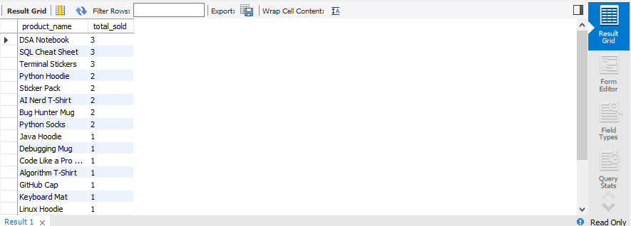
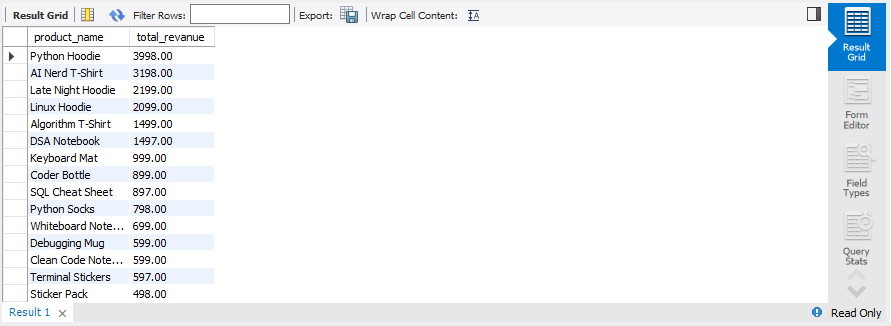
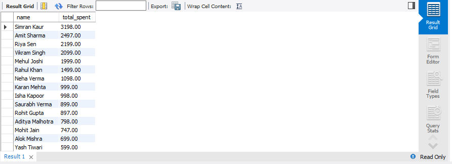
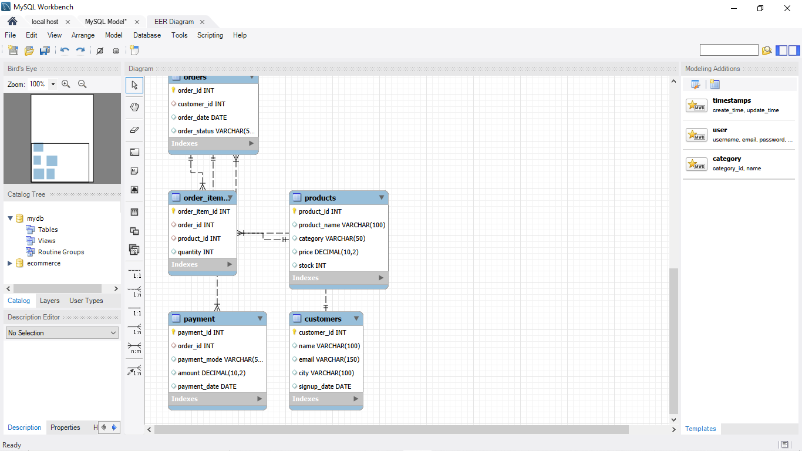

# E-Commerce SQL Data Analysis

A SQL-based e-commerce data analysis project built using MySQL to design a relational database, insert sample data, and answer business-oriented questions using SQL queries.

## 📌 Project Overview

This project simulates an e-commerce system with customers, products, orders, order items, and payments.

The main goal was to design a structured relational database and use SQL to analyze product sales, product revenue, and customer spending.

## 🎯 Project Objectives

- Design a relational e-commerce database
- Create tables with primary and foreign key relationships
- Insert and manage sample business data
- Analyze product sales performance
- Calculate revenue by product
- Identify high-spending customers
- Practice relational data analysis using SQL

## 🗄️ Database Structure

The database contains five main tables:

- Customers
- Products
- Orders
- Order Items
- Payments

### Relationships

- Customers → Orders
- Orders → Order Items
- Products → Order Items
- Orders → Payments

## 🛠️ Technologies & SQL Concepts

- MySQL
- CREATE DATABASE
- CREATE TABLE
- PRIMARY KEY
- FOREIGN KEY
- AUTO_INCREMENT
- UNIQUE constraints
- INSERT
- SELECT
- WHERE
- JOIN
- GROUP BY
- ORDER BY
- Aggregate functions
- SUM()

## 📊 Analysis Performed

### 1. Total Products Sold

Calculated the total quantity sold for each product using `SUM()` with `JOIN`, `GROUP BY`, and `ORDER BY`.

### 2. Total Revenue by Product

Calculated product-level revenue using:

`Quantity × Product Price`

and filtered the analysis to delivered orders.

### 3. Total Spent by Customer

Calculated the total amount spent by each customer by joining customers, orders, and payments.

## 🗺️ Database Schema

## 📁 Files Included

- `E-Commerce_tables.sql` — Database and table creation queries
- `Insert_data.sql` — Sample data insertion queries
- `show tables.sql` — Queries to display table data
- `total_product_sold.sql` — Product sales analysis query
- `total_revenue_by_product.sql` — Product revenue analysis query
- `total_spent_by_customer.sql` — Customer spending analysis query
- `database.png` — Database schema / relationship diagram
- `total_product_sold.png` — Product sales result
- `total_revenue_by_product.png` — Product revenue result
- `total_spent_by_customer.png` — Customer spending result

## 💡 Key Learning

This project helped me practice relational database design and SQL-based business analysis.

I learned how multiple related tables can be connected using primary and foreign keys and how SQL joins and aggregate functions can be used to transform transactional data into useful business insights.

## 👤 Author

**Mohd Amaan**

GitHub: [MohdAmaan-dataAnalytics](https://github.com/MohdAmaan-dataAnalytics)

